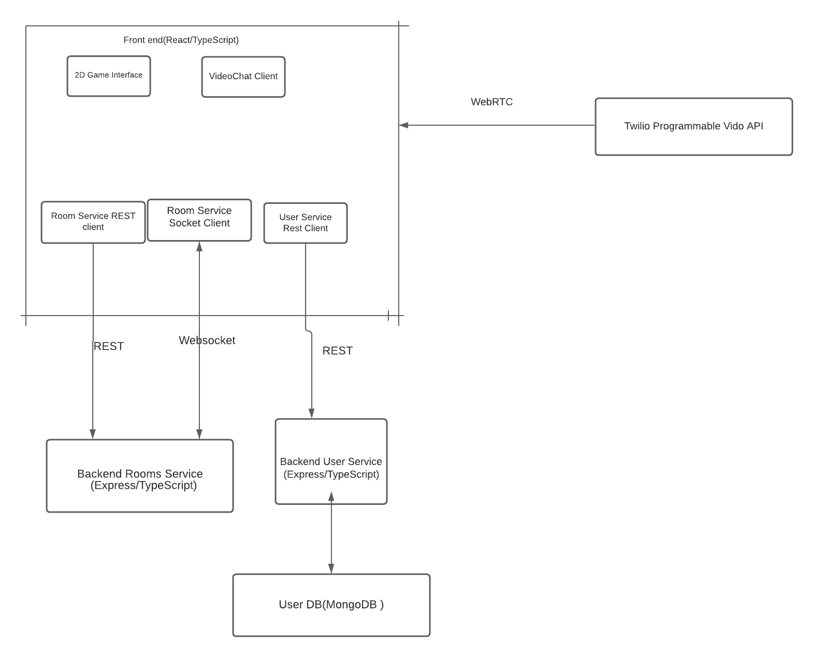

### New design structure

For the new code, we use Microservice architecture pattern. We add a ProfileServieClient and an independent backend user service. The User Service Client will use Rest API to communicate with the user sercice, and the user service will communicate with the database. All the user information will be stored in a User DB.

Our high-level architecure based on the original one.

### Changes on the existing codebase
### UI changes
1. We added three buttons as entries to sign up, Login and Logout in the TownSelection.tsx, so that the user will be able to sign up, login and log out in the Main page. Sign up and Login pages are all pop up windows, which makes the UI more cleaner and more consistent.
2. We can get the user login status by the ProfileService, and set the username to what's inputted into log in window. In this way, the user will be able to create a town to join or join any existing Towns.
 After the user login and select a town to join, he/she will be able to see the profile in the Town page as well as see other user's profile within the same town by clicking the profile button. He/sge will also be able to edit his/her own profile.  The UI of the profile page is also a pop up window. 

### Files we add for the Front-end. 
Besides the changes we made in the TownSelection.tsx, you can know more about the detailed implementation from `covey.town/frontend/src/components/Login/LoginPop.tsx`, `covey.town/frontend/src/components/Login/SignupPop.tsx`, `covey.town/frontend/src/components/Profile/MyProfile.tsx`, `covey.town/frontend/src/components/Profile/OthersProfiles.tsx`, and `covey.town/frontend/src/classes/Services/UserServiceClient.ts`

### Backend Changes
### todo 
We added a userService folder in the services folder, it is the back-end server of the user. We also connected the server with a MongoDB database.

